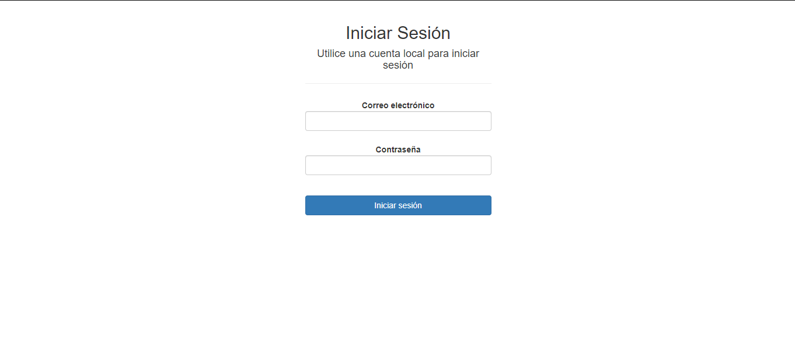
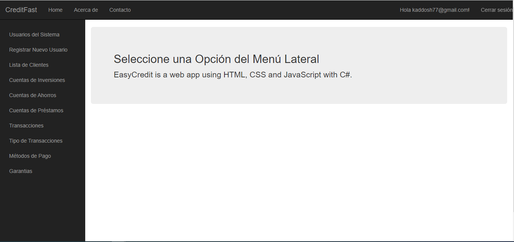
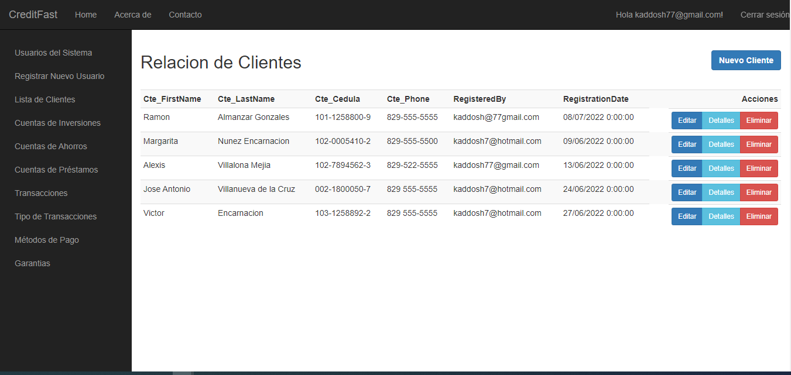
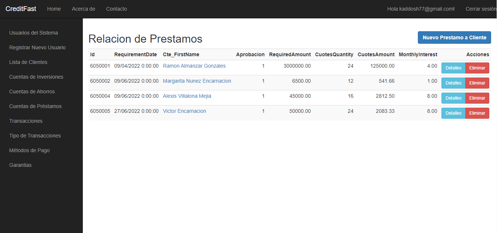
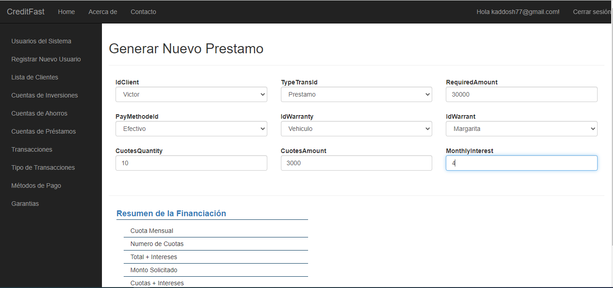
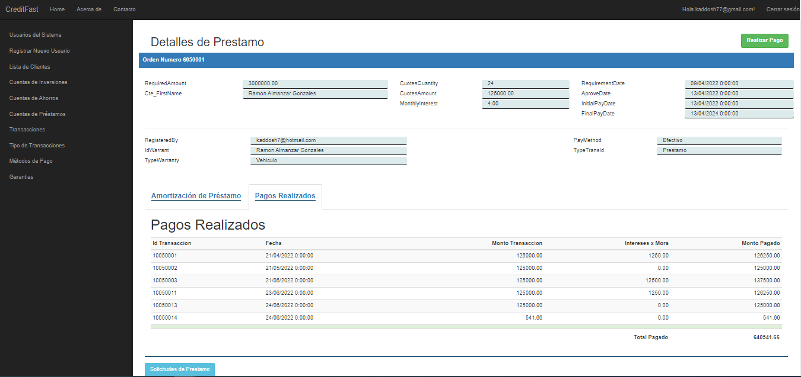

## EasyCredit. Préstamos y Cobros
<!--
You can use the [editor on GitHub](https://github.com/kaddosh7/EasyCredit/edit/gh-pages/index.md) to maintain and preview the content for your website in Markdown files.
-->
Un sistema donde se registran las operaciones basicas de una agencia de prestamos.
- Registro de personal
- Registro de Clientes
- Nuevos prestamos
- Estado de cuentas, etc

### Vista de Acceso

### Vista de Bienvenida

### Vista de Clientes
CRUD completo en cada vista del personal involucrado en el sistema donde se puede agregar, actualizar datos del personal y un eliminado logico de registros

### Vista de prestamos realizados

### Formulario de Prestamo
El formulario de registro de prestamo contiene campos calculados, lo que brinda una mejor experiencia del usuario (UX)

### Vista estado-detalles de prestamos
Esta vista muestra datos del cliente y detalles del prestamo (UX)

